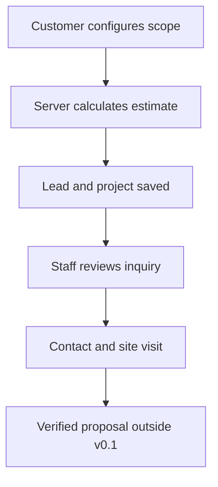

# Architecture

## Product boundary

Version 0.1 is a lead-to-site-visit system, not a complete construction ERP.

## Data model

| Model | Responsibility |
|---|---|
| `Lead` | Customer identity, location, project type, finish level, consent |
| `Estimate` | Immutable snapshot of selections, pricing version, and range |
| `Project` | Operational status, staff owner, site visit, and next action |
| `Activity` | Chronological audit trail of submissions, changes, and notes |

Keeping `Estimate` separate from `Project` matters. The estimate records what the customer saw at submission time; changing a project's status later does not rewrite that price snapshot.

## Trust boundaries

- JavaScript provides only a convenience preview.
- `projects/pricing.py` is the authoritative calculator.
- Django forms enforce data shape and quantity limits.
- Staff routes require an authenticated user with `is_staff=True`.
- CSRF protection is enabled for all state-changing forms.
- Production secrets are environment variables and excluded from Git.

## Important limitations

1. Prices are initial assumptions copied from the product concept. They require business verification.
2. There is no role separation between sales, estimator, and administrator.
3. There is no file upload, malware scanning, or customer-photo storage.
4. There is no notification delivery or failure handling.
5. The activity log is useful operational history, but it is not a tamper-proof compliance ledger.
6. A production deployment still requires backups, monitoring, error reporting, and a privacy policy.

## Why one Django application

The workflow requires forms, authentication, relational data, server-side validation, staff administration, and an audit trail. Django supplies these capabilities coherently. A microservice or separate JavaScript API would increase deployment and learning cost before the workflow has real users.

